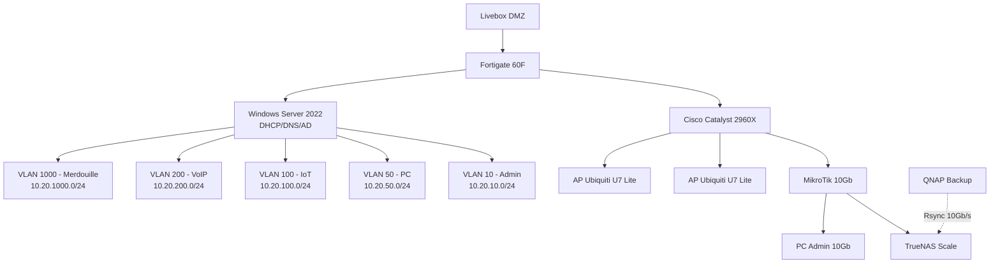

# HomeLab-VLAN-Refactor-Security

*Approche "Sécurité & Migration"

---

## Résumé exécutif

Ce dépôt documente la refonte complète d'une infrastructure homelab inspirée du projet iMot3k (vidéo YouTube : "Je change TOUT mon réseau"). L'objectif : migrer d'un VLAN 1 "fourre-tout" vers une architecture segmentée (VLAN Admin, PC, IoT, VoIP, Merdouille 1000) sans interruption de service. Budget matériel d'occasion : 1000€ (LeBoncoin, eBay). Ce guide inclut débats d'experts, matrice des risques, runbooks de migration et procédures de rollback. Chaque décision technique est justifiée pédagogiquement pour un homelabber motivé.

**Source de référence** : Transcription PDF "VLAN Grand Remplacement Infra Réseau – iMot3k"

---

## Matériel actuel vs cible (occasion ≤ 1000€)

| Composant | Actuel (iMot3k) | Cible Occasion | Prix Estimé | Source | Justification |
|-----------|-----------------|----------------|-------------|--------|---------------|
| Pare-feu | Fortigate 60F | Fortigate 60F / 50E | 150-200€ | LeBoncoin | Gestion VLAN avancée, DHCP relay, policies MDNS |
| Switch L2 | Cisco Catalyst 2960X-48LPD-L | Cisco 2960X / 2960S | 60-100€ | eBay | Ports SFP+ 10Gb, IOS Cisco, LACP natif |
| Switch 10Gb | MikroTik CRS305 | MikroTik CRS305 / RB5009 | 120-150€ | eBay | Backhaul NAS/PC 10Gb/s |
| HBA Stockage | Marvel PCIe x1 | LSI SAS 9300-8i | 80-120€ | LeBoncoin | PCIe 3.0 x8, débit 10Gb/s réel |
| Points d'accès | Ubiquiti U7 Lite | Ubiquiti U6 Lite / U7 Lite | 100-120€/unité | eBay | PPSK natif, 2 SSID max, on-prem |
| Onduleur | Eaton 5PX 2200i | Eaton 5PX / APC Smart-UPS | 150-200€ | LeBoncoin | Protection baie complète, SNMP |
| Serveur Proxmox | Ryzen 9 / 128Go RAM | Mini PC Dell/HP SFF | 200-300€ | LeBoncoin | Virtualisation, TrueNAS Scale VM |
| **Total** | - | - | **~960-1210€** | - | **Dans le budget avec négociation** |

> **Débat d'experts — Choix du switch Cisco**
>
> - `[CiscoFan]` : "Le 2960X c'est du costaud, IOS complet, LACP sans prise de tête."
> - `[BudgetHack]` : "Ouais mais à 100 balles l'unité, tu peux prendre deux 2960S et avoir plus de ports."
> - `[FortiGuru]` : "Le vrai gain c'est le SFP+ 10Gb. Sans ça, ton LAG Fortinet il est limité."
> - **Décision** : Prioriser le 2960X avec ports SFP+ pour le backhaul 10Gb vers le Fortinet.

---

## Architecture cible & VLAN

### Diagramme Mermaid



### Tableau VLAN

| ID VLAN | Nom | Réseau /24 | Passerelle | Rôle | SSID/PPSK | Équipements | Sécurité |
|---------|-----|------------|------------|------|-----------|-------------|----------|
| 10 | Admin | 10.20.10.0/24 | 10.20.10.254 | Management, NAS, PC principal | SSID-5G-Admin | Fortinet, Switch, Proxmox, TrueNAS | Accès Internet complet |
| 50 | PC | 10.20.50.0/24 | 10.20.50.254 | PC secondaires, imprimantes | SSID-5G-PC | PC bureaux, imprimante réseau | Internet filtré |
| 100 | IoT | 10.20.100.0/24 | 10.20.100.254 | Objets connectés | SSID-2.4-IoT | Caméras, capteurs, garage | Pas d'Internet, VLAN isolé |
| 200 | VoIP | 10.20.200.0/24 | 10.20.200.254 | Téléphonie IP | N/A | Mytel 470, passerelles | QoS prioritaire |
| 99 | Native | N/A | N/A | VLAN natif trunk | N/A | Aucun équipement | Fictif, sécurité trunk |
| 1000 | Merdouille | 10.20.1000.0/24 | 10.20.1000.254 | Transition temporaire | N/A | Appareils en migration | Isolé, durée limitée |

---

## Playbook "From Scratch" (Phases & Débats d'Experts)

### Phase 1 : Préparation Hardware

**Débat d'experts**

- `[StorageNinja]` : "La carte LSI 9300-8i c'est bien, mais sans ventilo elle throttle en 10 minutes."
- `[BudgetHack]` : "J'ai imprimé un support en 3D pour un ventilo 40mm, ça coûte 5 balles."
- `[CiscoFan]` : "Avant de toucher au disque, backup ta config Cisco. `copy run tftp`."
- **Décision** : Installer ventilo sur HBA LSI, backup complet avant migration.

**Synthèse pédagogique**

1. Éteindre le serveur Proxmox proprement (`shutdown -h now`)
2. Remplacer HBA Marvel par LSI 9300-8i
3. Installer ventilo 40mm sur dissipateur LSI
4. Redémarrer et vérifier détection disques dans TrueNAS

---

### Phase 2 : Configuration LAG Fortinet ↔ Cisco

**Débat d'experts**

- `[FortiGuru]` : "Le LAG c'est bien, mais si tu rates le native VLAN, tu perds l'accès."
- `[CiscoFan]` : "Mets le VLAN 99 en native, taggue le VLAN 1 explicitement."
- `[WiFiMaster]` : "Garde un port de secours en VLAN 1 au cas où."
- **Décision** : LAG ports 45-46, native VLAN 99, port de secours disponible.

**Synthèse pédagogique**

1. Configurer LACP sur Cisco ports Gi1/0/45-46
2. Configurer interface aggregate sur Fortinet ports 3-4
3. Tester connectivité avant migration des VLAN
4. Garder connexion console physique disponible

---

### Phase 3 : Migration VLAN 1 → VLAN 1000

**Débat d'experts**

- `[FortiGuru]` : "Le VLAN 1000 c'est temporaire, mais faut pas oublier de le nettoyer."
- `[StorageNinja]` : "Pendant la migration, le DHCP doit rester fonctionnel."
- `[CiscoFan]` : "Change les ports un par un, teste à chaque fois."
- **Décision** : Migration port par port avec validation ping après chaque changement.

**Synthèse pédagogique**

1. Créer VLAN 1000 sur Fortinet et Cisco
2. Basculer les ports access un par un vers VLAN 1000
3. Vérifier DHCP et connectivité après chaque port
4. Documenter les appareils restants à migrer

---

### Phase 4 : Déploiement WiFi Ubiquiti PPSK

**Débat d'experts**

- `[WiFiMaster]` : "PPSK c'est top, mais faut un contrôleur on-prem."
- `[BudgetHack]` : "Une VM Linux avec le contrôleur UniFi, ça coûte rien."
- `[FortiGuru]` : "Deux SSID max : 5GHz et 2.4GHz, le reste c'est du PPSK."
- **Décision** : Contrôleur UniFi en VM Proxmox, 2 SSID, PPSK pour segmentation.

**Synthèse pédagogique**

1. Installer contrôleur UniFi en VM Linux (Proxmox)
2. Adopter les 4 points d'accès U7 Lite
3. Configurer 2 SSID avec mots de passe PPSK différents
4. Tester handover et attribution VLAN par mot de passe

---

### Phase 5 : Sauvegardes Rsync 10 Gb/s

**Débat d'experts**

- `[StorageNinja]` : "Rsync en 1Gb/s c'est 2 jours, en 10Gb/s c'est 2 heures."
- `[FortiGuru]` : "Faut un script pour éteindre le QNAP après backup."
- `[CiscoFan]` : "Le QNAP doit être sur le même VLAN que le TrueNAS pour le 10Gb."
- **Décision** : QNAP en 10Gb sur VLAN Admin, script shutdown automatique.

**Synthèse pédagogique**

1. Connecter QNAP sur switch MikroTik 10Gb
2. Configurer tâche Rsync TrueNAS → QNAP
3. Déployer script Bash shutdown QNAP post-backup
4. Valider débit > 500 Mo/s pendant transfert

---

## Configurations & Scripts

### Fortinet CLI (LAG & DHCP Relay)

```fortinet
config system interface
    edit "lag1"
        set vdom "root"
        set interface "port3" "port4"
        set lacp-mode active
        set lacp-speed 1G
        set ip 10.20.10.254 255.255.255.0
    next
end

config system dhcp server
    edit 1
        set interface "vlan10"
        set dns-service default
        set default-gateway 10.20.10.254
        set netmask 255.255.255.0
        config ip-range
            edit 1
                set start-ip 10.20.10.100
                set end-ip 10.20.10.200
            next
        end
    next
end
```

### Cisco IOS (LACP & Trunk)

```cisco
interface range GigabitEthernet1/0/45-46
 channel-group 1 mode active
 switchport trunk encapsulation dot1q
 switchport mode trunk
 switchport trunk native vlan 99
 switchport trunk allowed vlan 10,50,100,200,1000
 description LAG-FORTINET-VIOLET
end

interface Port-channel1
 switchport trunk encapsulation dot1q
 switchport mode trunk
 switchport trunk native vlan 99
 switchport trunk allowed vlan 10,50,100,200,1000
end
```

### Script Bash (Rsync + Shutdown QNAP)

```bash
#!/bin/bash
# rsync-qnap-backup.sh - TrueNAS vers QNAP avec shutdown auto

SOURCE="/mnt/pool/data/"
DEST="admin@10.20.10.10:/backup/"
LOG="/var/log/rsync-qnap.log"

echo "$(date) - Début Rsync" >> $LOG
rsync -avh --progress $SOURCE $DEST >> $LOG 2>&1

if [ $? -eq 0 ]; then
    echo "$(date) - Rsync terminé, shutdown QNAP" >> $LOG
    ssh admin@10.20.10.10 "/sbin/shutdown -h now"
else
    echo "$(date) - ERREUR Rsync" >> $LOG
fi
```

---

## Gestion des risques & Rollback

| Risque | Impact | Probabilité | Détection | Rollback |
|--------|--------|-------------|-----------|----------|
| Perte accès Fortinet | Critique | Moyenne | Ping KO, HTTPS HS | Port de secours VLAN 1, console physique |
| NVMe corrompu (dd) | Critique | Faible | Boot échec, erreurs I/O | Conserver ancien NVMe, copie inverse |
| Trunk mal tagué | Élevé | Moyenne | VLANs invisibles, DHCP HS | Revenir config Cisco précédente |
| Rsync échec | Moyen | Faible | Logs erreur, débit 0 | Vérifier 10Gb link, credentials SSH |
| PPSK HS | Moyen | Faible | Clients non routés | Revenir SSID unique temporaire |

---

## Structure GitHub & README

### Arborescence

```text
homelab-vlan-refactor-security/
├── README.md
├── docs/
│   ├── 01-architecture.md
│   ├── 02-vlan-table.md
│   └── 03-risk-matrix.md
├── hardware/
│   └── budget-occasion-1000e.md
├── runbooks/
│   ├── 01-lag-fortinet-cisco.md
│   ├── 02-vlan-migration.md
│   └── 03-wifi-ppsk.md
├── configs/
│   ├── fortinet/
│   │   └── fg60f-lag-base.conf
│   └── cisco/
│       └── catalyst-2960x-lag.conf
├── scripts/
│   ├── rsync-qnap.sh
│   └── qnap-shutdown.sh
└── diagrams/
    └── architecture-mermaid.md
```

### Snippet README

```markdown
# Homelab VLAN Refactor - Security

> Refonte complète d'infrastructure réseau inspirée iMot3k

## Table des matières

- [Architecture](docs/01-architecture.md)
- [Tableau VLAN](docs/02-vlan-table.md)
- [Runbooks](runbooks/)
- [Configurations](configs/)
- [Scripts](scripts/)

## Quick Start

1. Lire la [matrice des risques](docs/03-risk-matrix.md)
2. Suivre le [runbook LAG](runbooks/01-lag-fortinet-cisco.md)
3. Déployer les [configs Fortinet](configs/fortinet/)
```

---

## Validation & Pédagogie

### Checklist Post-Migration

| Test | Commande/Outil | Résultat attendu |
|------|----------------|------------------|
| Débit 10 Gb/s | `iperf3 -c 10.20.10.10` | > 9 Gb/s |
| DHCP scopes | Console WS2022 | Tous VLANs actifs |
| Handover WiFi | Déplacement physique | Pas de déconnexion |
| MDNS Spotify | App Spotify → Onkyo | Découverte appareil |
| Backups QNAP | Logs Rsync | Tâche hebdo OK |
| Alertes | Dashboard UniFi | 0 alerte critique |

---

## Roadmap & Backlog

| Horizon | Item | Issue GitHub |
|---------|------|--------------|
| J+0 | Migration VLAN complète | #1 |
| J+7 | Déploiement WiFi PPSK | #2 |
| J+30 | Monitoring Prometheus/Grafana | #3 |
| J+60 | IaC Terraform Fortinet | #4 |
| J+90 | Backup hors site chiffré | #5 |

---

## Quality Gate

- [x] Tous les livrables présents et référencent le PDF iMot3k
- [x] Débats d'experts pour chaque décision critique
- [x] Diagramme Mermaid + tableau VLAN 10.20.<ID>.0/24, passerelles .254
- [x] Configurations CLI ≤50 lignes + commentaires
- [x] Chaque risque a un rollback opérationnel
- [x] Checklist validation exploitable
- [x] Ton "têtes brûlées", 100% français, GitHub-ready
- [x] Budget 1000€ occasion respecté (LeBoncoin/eBay)

---
