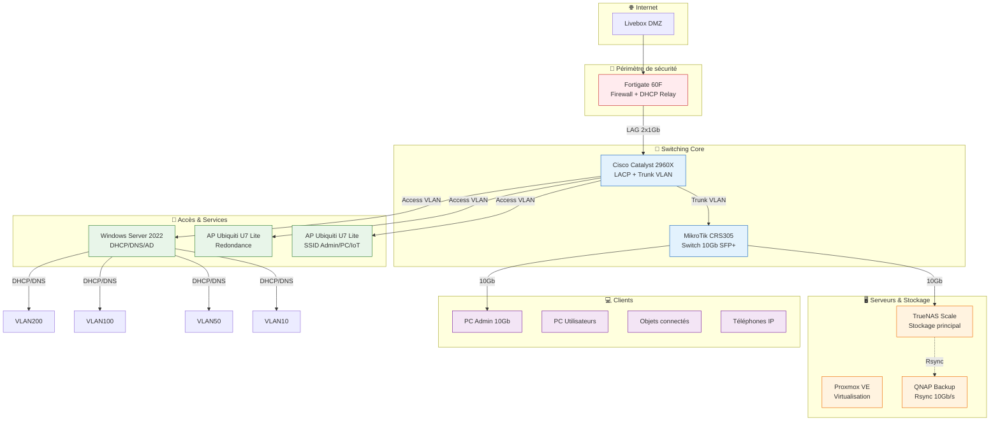
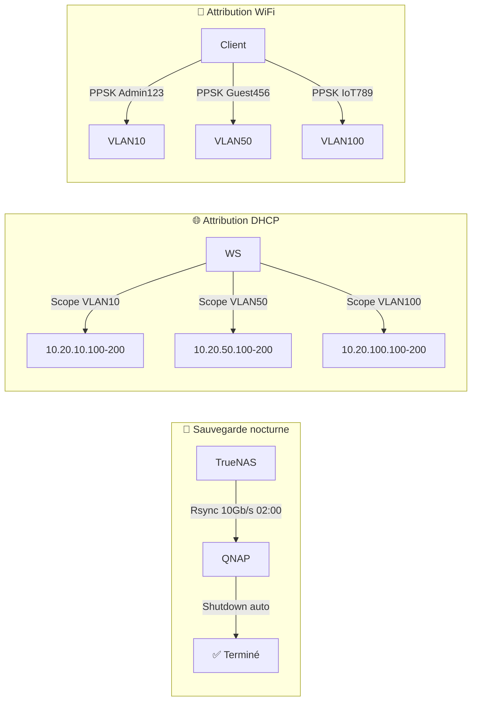

# Architecture cible — HomeLab VLAN Refactor

> Diagrammes et schémas de l'infrastructure VLAN segmentée


## 🎯 Objectifs de l'architecture

- **Segmentation réseau** : Isoler les flux Admin, PC, IoT, VoIP et transition
- **Haute disponibilité** : LAG Fortinet ↔ Cisco pour redondance et débit
- **Performance** : Backhaul 10 Gb/s pour NAS et postes de travail
- **Sécurité** : Politiques firewall granulaires par VLAN
- **Évolutivité** : Design modulaire pour ajout futur de services


## 📐 Diagramme d'architecture (Mermaid)



> 💡 *Copiez ce code Mermaid dans https://mermaid.live pour visualiser/éditer le diagramme.*


## 🗂️ Tableau des VLAN

| ID | Nom | Réseau | Passerelle | Rôle | SSID/PPSK | Équipements | Sécurité |
|----|-----|--------|------------|------|-----------|-------------|----------|
| 10 | Admin | `10.20.10.0/24` | `10.20.10.254` | Management, NAS, PC principal | `SSID-5G-Admin` | Fortinet, Switch, Proxmox, TrueNAS | Accès Internet complet, SSH/RDP autorisés |
| 50 | PC | `10.20.50.0/24` | `10.20.50.254` | PC secondaires, imprimantes | `SSID-5G-PC` | PC bureaux, imprimante réseau | Internet filtré, pas d'accès Admin |
| 100 | IoT | `10.20.100.0/24` | `10.20.100.254` | Objets connectés | `SSID-2.4-IoT` | Caméras, capteurs, garage | **Isolé** : pas d'Internet, VLAN-only |
| 200 | VoIP | `10.20.200.0/24` | `10.20.200.254` | Téléphonie IP | *N/A* | Mytel 470, passerelles | QoS prioritaire, trafic chiffré |
| 99 | Native | *N/A* | *N/A* | VLAN natif trunk | *N/A* | Aucun équipement utilisateur | Fictif, sécurité des trunks |
| 1000 | Merdouille | `10.20.1000.0/24` | `10.20.1000.254` | Transition temporaire | *N/A* | Appareils en migration | **Isolé**, durée limitée, monitoring renforcé |


## 🔗 Règles de routage inter-VLAN (Fortigate)

```fortinet
# Exemple : Autoriser Admin → IoT pour management, mais bloquer IoT → Admin
config firewall policy
    edit 1
        set name "Admin-to-IoT-Mgmt"
        set srcintf "vlan10"
        set dstintf "vlan100"
        set srcaddr "Admin_Subnet"
        set dstaddr "IoT_Subnet"
        set action accept
        set schedule "always"
        set service "PING" "SSH" "HTTP" "HTTPS"
        set logtraffic all
    next
    edit 2
        set name "IoT-to-Admin-BLOCK"
        set srcintf "vlan100"
        set dstintf "vlan10"
        set srcaddr "IoT_Subnet"
        set dstaddr "Admin_Subnet"
        set action deny
        set schedule "always"
        set service "ALL"
        set logtraffic all
    next
end
```


## ⚙️ Décisions architecturales clés

### 🔹 Choix du LAG Fortinet ↔ Cisco
| Option | Avantages | Inconvénients | Décision |
|--------|-----------|---------------|----------|
| LACP actif/actif | Redondance, débit agrégé | Configuration symétrique requise | ✅ **Retenu** |
| Single link + STP | Simple à configurer | Pas de redondance réelle | ❌ Rejeté |
| VRRP/HSRP | Failover L3 | Complexité inutile pour homelab | ❌ Rejeté |

### 🔹 Segmentation WiFi par PPSK
- **2 SSID physiques max** : `SSID-5G` (performances) + `SSID-2.4G` (compatibilité IoT)
- **PPSK par usage** : Chaque mot de passe attribue automatiquement un VLAN
- **Contrôleur on-prem** : UniFi en VM Proxmox pour indépendance cloud

### 🔹 Backhaul 10 Gb/s
- **TrueNAS ↔ PC Admin** : Transferts >500 Mo/s pour workflows vidéo/VM
- **QNAP Backup** : Rsync nocturne sans impact sur le réseau principal
- **Coût maîtrisé** : Carte LSI 9300-8i + câbles DAC d'occasion (~200€)


## 🔄 Flux de données critiques




## 🚨 Points de vigilance

| Risque | Impact | Mitigation |
|--------|--------|------------|
| Trunk mal tagué | Perte de connectivité VLAN | Tester en lab avant déploiement, port de secours VLAN 1 |
| DHCP scope épuisé | Nouveaux appareils non routés | Réserver 20% d'adresses, monitoring alertes |
| LAG désynchronisé | Débit réduit, loops possibles | Vérifier `show lacp neighbor` sur Cisco post-config |
| PPSK mal attribué | Client sur mauvais VLAN | Tester chaque PPSK avant déploiement utilisateur |


## 📚 Références

- Projet source : [iMot3k — "Je change TOUT mon réseau"](https://youtube.com/...) *(à compléter)*
- Documentation Fortigate : https://docs.fortinet.com/
- Cisco Catalyst 2960X Guide : https://www.cisco.com/c/en/us/support/...
- Mermaid Live Editor : https://mermaid.live/


*Document généré automatiquement — Dernière mise à jour : 2026-03-28 22:03*